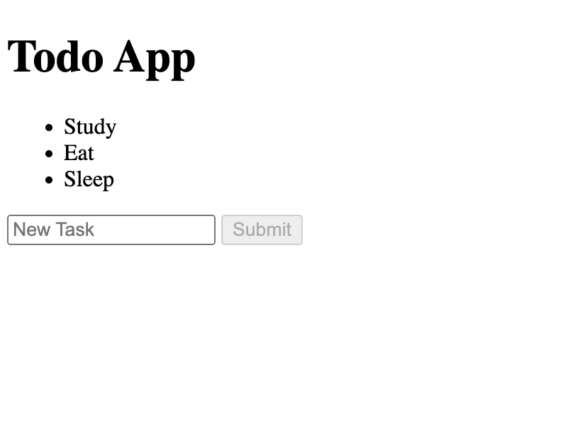

# ToDo App Exercise - HTML and JavaScript

Welcome to the ToDo App Exercise! In this assignment, you will build a basic ToDo application using only HTML and JavaScript.

## 🎯 Objective:
Your task is to create a simple ToDo application that allows a user to:

1. Enter a task using a form.
2. View the entered task appended to an unordered list on the page.
3. Remove the task they want to delete (by clicking in a individual button for each item)

You'll only write in the `exercise.html` file. 
In case you need to see the solution, it is at `the_answer.html`.

## 📚 Starter Code
The HTML code consists of two primary components:

1. **Task Display List**
   - **Container**: A `
` element that groups the content related to task display.
   - **Unordered List**: An `<ul>` element with the ID `tasks`, dedicated to displaying tasks. This list is dynamically manipulated using JavaScript to add, remove, or show tasks as needed.

2. **Task Input Form**
   - **Container**: Another `
` element that encapsulates the form elements.
   - **Form Element**: A `<form>` tag, which is the foundation of the task input functionality. It is designed to be interacted with via JavaScript.
     - **Task Input Field**: An `<input>` element of the type text, identified by the ID `task`. It includes a placeholder attribute with the text "New Task", guiding users on where to enter new tasks.
     - **Submit Button**: An `<input>` element of the type submit, marked with the ID `submit`. This button is intended to trigger the addition of the new task. The actual submission logic is presumed to be handled by JavaScript.

## ✅ Specific Tasks (JavaScript):
#### 1. Store the components of HTML in JavaScript variables
   - **a.** Create a variable to store the `<form>` tag
   - **b.** Create a variable to store the `<ul>` tag
   - **c.** Create a variable to store the `<button>` tag
   - **d.** Create a variable to store the `<input>` tag

#### 2. Set the submit button disabled when you enter on the page

#### 3. Add an event listener to the input to detect when it's keyup
   - **a.** When there is nothing typed in the input, turns the submit button disabled
   - **b.** When there is something typed in the input, turns the submit button enable
         
#### 4. Add an event listener to the form to detect when it's submitted.
   - **a.** When the form is submitted, prevent its default behavior (which might refresh the page).
   - **b.** Retrieve the task entered by the user from the input field.
   - **c.** Create a new list item (`<li>`)
   - **d.** Add new task value in list item using innerHTML function
   - **e.** Create a `<button>` tag to each individual `<li>` created
   - **f.** Add message 'Delete' in the button using innerHTML function
   - **g.** Listen When delete button is clicked
       - Remove the item from list (use removeChild function)
   - **h.** Add the deleteButton to the `<li>` tag using the appendChild function
   - **i.** Add the `<li>` tag to `<ul>` tag using the appendChild function
   - **j.** Clear the input field to allow for the entry of a new task.
   - **k.** Disable button when there is nothing in newtask

## 📘 How to Run Your Website:
1. Go to the terminal
2. Run the command `npm start`
3. It will generate a link in your terminal. Click on that link and then `exercise.html` that appears in this link.
   You will see your website!

## 🚀 How to Run Tests:
After completing the exercise, you can run the provided tests to ensure that your ToDo application is functioning as expected:
1. Go to the terminal
2. Run the command `sudo apt-get update` to install the things that we need to test your code.
3. Run the command `sudo apt-get install -y libxshmfence1` to install the things that we need to test your code.
4. Run the command `npm test` to execute the tests.
  If all goes well, you should see a message indicating the tests that passed. If there are issues, the failed tests will provide hints or messages to help you identify the problem.

## 🤔 How to Submit:
Once all the tests have completed:
1. Stage Changes:
  - View your changes in the Source Control view.
  - Click on the + (plus) sign next to the files you wish to stage.
2. Commit Changes:
  - Enter a descriptive commit message.
  - Press Ctrl + Enter (or Cmd + Enter on macOS) to commit the changes.
3. Push Changes:
  - Click on the ellipsis ... in the Source Control view.
  - Select Push.
4.Verify you code has passed

## How the Project will Look Like

## 🤔 Need Help?
- Clarifications: If you need any clarifications, don't hesitate to reach out on Discord.
- Solutions: A file named `the_answer.html` is available. Refer to it only if you've spent a significant amount of time (30+ minutes) on a problem without progress.
